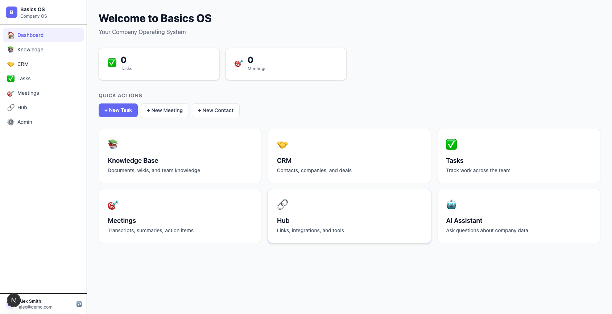
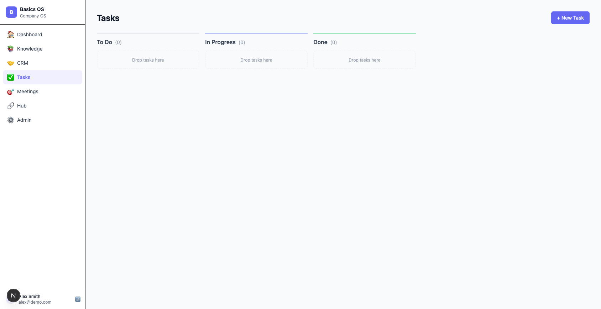

# Basics OS

The last piece of software your company will ever need. An open-source company operating system with knowledge base, CRM, task manager, meeting intelligence, AI assistant, and more — accessible from web, desktop, mobile, and AI tools via MCP.



---

## Quick Start

```bash
# Prerequisites: Docker Desktop, Node.js 20+, pnpm 9+

git clone https://github.com/basicos/basicos
cd basicos
pnpm dev:setup    # generates .env, starts Postgres + Redis, builds packages, runs migrations, seeds demo data
```

Then open two terminals:

```bash
# Terminal 1 — API server (port 3001)
pnpm --filter @basicsos/api dev

# Terminal 2 — Web portal (port 3000)
pnpm --filter @basicsos/web dev
```

Open **http://localhost:3000**. Demo login: `admin@acme.example.com`.

```bash
# Optional — other platforms
pnpm --filter @basicsos/desktop dev    # Desktop overlay (requires web on :3000)
pnpm --filter @basicsos/mobile start   # Mobile app (Expo)
```

### Environment Variables

**Required** (auto-generated by `pnpm dev:setup`):

| Variable | Purpose |
|----------|---------|
| `DATABASE_URL` | PostgreSQL connection string |
| `REDIS_URL` | Redis connection string |
| `BETTER_AUTH_SECRET` | Auth session signing key |
| `BETTER_AUTH_URL` | Auth server URL (usually `http://localhost:3000`) |

**Optional** (enable specific features):

| Variable | Feature |
|----------|---------|
| `AI_API_KEY` or `ANTHROPIC_API_KEY` | AI assistant, meeting summaries, embeddings |
| `DEEPGRAM_API_KEY` | Live meeting transcription |
| `STRIPE_SECRET_KEY`, `STRIPE_WEBHOOK_SECRET` | Billing and subscriptions |
| `STRIPE_PRICE_STARTER`, `STRIPE_PRICE_TEAM` | Stripe plan price IDs |
| `SLACK_CLIENT_ID` / `SECRET` | Hub: Slack integration |
| `GOOGLE_CLIENT_ID` / `SECRET` | Hub: Google Drive integration |
| `GITHUB_CLIENT_ID` / `SECRET` | Hub: GitHub integration |
| `OAUTH_ENCRYPTION_KEY` | AES-256-GCM for OAuth tokens (64 hex chars) |

You can also use a **managed AI key** from [basicsos.com/keys](https://basicsos.com/keys) that covers all models, speech, and embeddings:

```bash
AI_API_KEY=bsk_live_...
AI_API_URL=https://api.basicsos.com
```

### Commands

```bash
pnpm dev:setup              # first-time setup (Docker, env, migrations, seed)
pnpm --filter @basicsos/api dev    # API server on :3001
pnpm --filter @basicsos/web dev    # Web portal on :3000
pnpm test                   # all unit tests (197 passing)
npx vitest run              # integration + security tests
pnpm db:generate            # generate migration from schema changes
pnpm db:migrate             # apply pending migrations
node run-migration.cjs      # alternative migration runner
pnpm db:studio              # open Drizzle Studio
pnpm gen:module             # scaffold a new module (interactive)
```

---

## Architecture

Every platform connects to one tRPC API server. One database. One auth system. One event bus.

```
User -> Web / Desktop / Mobile / MCP
           |
     tRPC appRouter (packages/api) -- 14 routers
           |
     PostgreSQL + pgvector (packages/db) -- 34 tables, RLS
           |
     EventBus -> BullMQ workers -> side effects
                   |-- embedding (vectorize docs + transcripts)
                   |-- meeting-processor (AI summaries)
                   |-- notification (push + in-app)
                   |-- ai-employee (autonomous tasks)
                   |-- automation-executor (trigger -> action chains)
                   |-- import (bulk data ingestion)
```

### Repository Structure

```
apps/
  web/            Next.js 15 web portal (main UI)
  desktop/        Electron v33 desktop app (overlay + dashboard)
  mobile/         Expo SDK 54 mobile app (iOS + Android)
  mcp/company/    Company MCP server (AI tools connect here)
  mcp/engineer/   Engineer MCP server (Claude Code connects here)

packages/
  api/            tRPC v11 + Hono v4 API server
  db/             Drizzle ORM schema (34 tables, RLS, pgvector)
  auth/           Better Auth v1 (RBAC: admin/member/viewer)
  shared/         Zod validators, TypeScript types, event schemas
  ui/             Shared React components (Tailwind v4 + Radix + Lucide)
  sync/           Yjs CRDTs for real-time collaboration
  config/         Shared TS, ESLint, Prettier configs

context/          AI context files (architecture, modules, platforms, infra)
.claude/
  skills/         10 Claude Code skills
  agents/         7 Claude Code agents
```

---

## Features by Platform

### Web App



#### Core Modules

| Module | Features |
|--------|----------|
| **Knowledge Base** | Hierarchical documents, TipTap rich-text editor (bold/italic/headings/lists/code), Yjs real-time collaboration with live cursors, full-text search, vision capture (screenshot to doc via Claude) |
| **CRM** | Contacts + Companies + Deals CRUD, 6-stage Kanban pipeline (Lead / Qualified / Proposal / Negotiation / Won / Lost), deal activities log (notes/emails/calls/meetings), full-text search |
| **Tasks** | 3-column Kanban board (To Do / In Progress / Done), drag-and-drop between columns, priority levels (low/medium/high/urgent), due dates, assignees, source tracking (meeting/automation/AI) |
| **Meetings** | Create meetings with attendees, paste transcripts or record live audio (Deepgram), AI-generated structured summaries (decisions/action items/follow-ups), in-browser audio recording, video notes |
| **Hub** | Bookmarked links with categories and emoji icons, OAuth integrations (Slack, Google Drive, GitHub) with connect/disconnect flow, encrypted token storage (AES-256-GCM) |
| **AI Assistant** | Streaming SSE chat grounded in company data via RAG, suggested prompts, floating chat panel widget on every dashboard page, conversation history |
| **AI Employees** | Autonomous AI jobs with instructions, human-in-the-loop approval workflow, job lifecycle (pending/running/awaiting_approval/completed/failed/killed) |
| **Automations** | Event-driven workflow definitions with trigger + action chain CRUD, execution history |

#### Admin Panel

| Page | Features |
|------|----------|
| **Team** (`/admin/team`) | View members, invite by email, role management (admin/member/viewer) |
| **Modules** (`/admin/modules`) | Toggle 7 modules on/off per tenant with switch controls |
| **Usage** (`/admin/usage`) | LLM request count, token totals, estimated cost in USD, breakdown by model/user/feature |
| **Security** (`/admin/security`) | Immutable audit log trail (event type, user email, timestamp) |
| **Branding** (`/admin/branding`) | Company name, logo URL, accent color with live sidebar preview |
| **MCP** (`/admin/mcp`) | Server health check (pulsing indicator), Claude Desktop config with copy button |

#### Auth and Onboarding

- **Login** — email/password sign-in
- **Register** — self-service account creation
- **Invite** — accept team invite via token link with pre-filled role
- **Onboarding** — 5-step wizard with text-to-speech narration (profile, module tour, AI setup, desktop download)
- **Settings** — change password, MCP connection config (Claude Desktop/Cursor/HTTP), desktop app download
- **Route protection** — middleware redirects unauthenticated users to `/login`

---

### Desktop App (macOS / Windows / Linux)

Electron v33 with a floating overlay accessible via global keyboard shortcut.

| Feature | Description |
|---------|-------------|
| **Main Window** | Full web app (1280x800), session cookie auth, hidden inset title bar on macOS |
| **Overlay Window** | 420x480, frameless, transparent, always-on-top, vibrancy blur, visible on all workspaces |
| **Global Shortcut** | `Cmd+Shift+Space` (macOS) / `Ctrl+Shift+Space` toggles overlay |
| **Ask Tab** | AI Q&A about company data, 4 quick-action navigation buttons (Tasks/CRM/Meetings/Knowledge), dashboard link |
| **Meetings Tab** | Live meeting detection with red pulse dot, real-time transcript polling every 3s, recent 5 meetings list |
| **Voice Tab** | Web Speech API with two modes: **Dictate** (speech-to-text injected into any active app field) and **Command** ("create task: buy groceries", "search quarterly report", "open meetings") |
| **Capture Tab** | Screenshots primary display (hides overlay first), sends to Claude vision for analysis, saves result to knowledge base |
| **Text Injection** | Clipboard write + simulated paste keystroke (osascript on macOS, PowerShell on Windows) |
| **Dynamic Branding** | Fetches company name/logo/accent color from `/api/branding` on startup, falls back to defaults |
| **Auto-Updater** | `electron-updater` checks on startup (packaged builds only), also available from tray menu |
| **System Tray** | Open main window, toggle overlay, check for updates, quit |
| **Click-Through** | Overlay toggles `setIgnoreMouseEvents` for pass-through interaction |
| **Link Routing** | Same-origin links open in main window, external links open in system browser |

---

### Mobile App (iOS / Android)

Expo SDK 54 with 7 bottom tabs and push notification support.

| Tab | Features |
|-----|----------|
| **Home** | Dashboard with live task/meeting counts, 6-module navigation grid |
| **Tasks** | Task list with status badges (todo/in-progress/done) and color-coded priority (urgent=red, high=orange, medium=yellow, low=gray) |
| **CRM** | Contacts list with initial avatar, name, email, phone |
| **Meetings** | Meeting list with date blocks, detail view with participants, video notes (record or pick from library via expo-av), transcript display, AI summary sections |
| **Knowledge** | Document list with titles and dates (taps open web app for editing) |
| **Assistant** | Chat interface with user/assistant message bubbles, keyboard-avoiding input, 2000-char limit |
| **AI Employees** | Job list with status badges, expandable detail panel with outputs, approve/stop controls |
| **Hub** | 2-column link grid with category badges, taps open in system browser |

**Additional mobile features:**
- Email/password login and registration with `expo-secure-store` token storage
- Push notification registration via Expo Push API (auto-cleans stale tokens)
- Video recording/selection for meeting notes
- Auth guard redirects to login if no stored token

---

### MCP Servers

#### Company MCP (`apps/mcp/company/`)

AI assistants (Claude, ChatGPT, Cursor, etc.) connect here to access company data. Runs as a system caller with admin context, scoped by tenant via `MCP_TENANT_ID`.

| Tool | Parameters | Description |
|------|------------|-------------|
| `search_knowledge_base` | `query` | Search documents by text |
| `query_crm` | `query`, `type` (contacts/companies/deals/all) | Search CRM data |
| `list_tasks` | `status?` (todo/in-progress/done) | List tasks with optional filter |
| `search_meetings` | `query` | Search meeting transcripts and summaries |

```bash
MCP_TENANT_ID=<tenant-id> pnpm --filter @basicsos/mcp-company dev   # port 4000
```

#### Engineer MCP (`apps/mcp/engineer/`)

Claude Code connects here for project context during development.

| Resource | Description |
|----------|-------------|
| `team-context` | Sprint data, team roster, deployment status |
| `claude-md` | Full CLAUDE.md developer guide |
| `skills` | All available Claude Code skill definitions |

```bash
REPO_ROOT=$PWD pnpm --filter @basicsos/mcp-engineer dev   # port 4001
```

---

### Backend API (`packages/api/`)

#### 14 tRPC Routers

| Router | Key Procedures |
|--------|---------------|
| `auth` | `me`, `sendInvite`, `validateInvite`, `completeOnboarding`, `registerPushToken`, `unregisterPushToken` |
| `knowledge` | `list`, `get`, `create`, `update`, `delete`, `reorder`, `createFromCapture`, `search` |
| `tasks` | `list`, `get`, `create`, `update`, `delete`, `getOverdue` |
| `crm` | contacts/companies/deals/activities — full CRUD, `listByStage` for pipeline |
| `meetings` | `list`, `get`, `create`, `uploadTranscript`, `process`, `transcribeAudio`, `getTranscript`, `search` |
| `search` | `semantic` — pgvector cosine similarity across docs + meetings |
| `assistant` | `chat` — non-streaming RAG chat (streaming is via SSE endpoint) |
| `modules` | `list`, `getStatus`, `setEnabled` |
| `automations` | `list`, `get`, `create`, `update`, `setEnabled`, `delete`, `listRuns` |
| `hub` | links CRUD, `getOAuthUrl`, `storeOAuthToken`, `disconnectIntegration`, `listIntegrations` |
| `aiEmployees` | `listJobs`, `getJob`, `createJob`, `kill`, `approveOutput`, `listOutputs` |
| `admin` | `getBranding`, `updateBranding`, `getUsageStats`, `getAuditLog` |
| `billing` | `getSubscription`, `createCheckoutSession`, `createPortalSession` |
| `llmKeys` | `list`, `create`, `setActive`, `delete` + internal `validateVirtualKey` |

#### Non-tRPC HTTP Endpoints

| Endpoint | Purpose |
|----------|---------|
| `GET /health` | Health check (returns `{ status: "ok" }`) |
| `POST /v1/chat/completions` | OpenAI-compatible LLM proxy, authenticated via virtual key (`bos_live_sk_...`) |
| `POST /stream/assistant` | Streaming AI assistant via SSE with RAG context |

#### Background Workers

| Worker | Queue | What It Does |
|--------|-------|-------------|
| **Embedding** | `embedding` | Chunks documents/transcripts, generates pgvector embeddings via OpenAI |
| **Meeting Processor** | `meeting-processor` | Transcript to structured AI summary (Haiku) + push notification |
| **Notification** | `notification` | Persists in-app notification + sends via Expo Push API |
| **AI Employee** | _(event-driven)_ | Runs Sonnet completion, creates output with `requiresApproval` gate |
| **Automation Executor** | `automation-executor` | Framework exists, **action chain execution is stubbed** |
| **Import** | `import` | Queue defined, **no processing logic yet** |

---

## Feature Gaps

Known incomplete or missing features, roughly ordered by impact:

| Gap | Current State | Impact |
|-----|---------------|--------|
| **Mobile is read-only** | No create/edit/delete for tasks, contacts, meetings, docs, or links | Mobile users can only view data, must use web to create anything |
| **Automation execution** | Router + worker skeleton exist, but action chain processing is stubbed | Automations can be defined but don't actually run |
| **Import worker** | Queue defined, no processing logic | No bulk CSV/JSON data ingestion |
| **Desktop Ask tab uses non-streaming AI** | `streamAssistant()` helper exists in `api.ts` but isn't wired into the tab | Slower perceived response in overlay vs web |
| **No web/desktop push notifications** | Push only goes to mobile via Expo Push API | Web and desktop users miss real-time alerts |
| **No offline support** | All platforms require network for every feature | Unusable without connectivity |
| **No desktop test coverage** | Vitest in `package.json` but zero test files | No regression coverage for Electron app |
| **No mobile settings/profile screen** | Not implemented | Users must use web for account and password management |
| **Admin billing page is informational only** | Links to external site, no in-app Stripe checkout | Billing setup requires leaving the app |
| **Query analyzer is keyword-based** | No ML/LLM — uses regex patterns to classify search intent | RAG results may miss relevant sources for ambiguous queries |

---

## Deployment

### Railway (Recommended)

One-click deploy via `infra/railway/template.json`:

```bash
railway up
```

- `railway.toml` defines two services: `web` (port 3000) and `api` (port 3001)
- Template auto-provisions PostgreSQL 16 (pgvector) + Redis
- `BETTER_AUTH_SECRET` and `OAUTH_ENCRYPTION_KEY` are auto-generated
- AI/billing/OAuth keys are optional — features degrade gracefully

### Docker (Self-Hosted)

```bash
docker-compose up                              # dev: Postgres + Redis only
docker-compose -f docker-compose.prod.yml up   # prod: full stack
```

### Deployment Modes

| Mode | Cost | What You Manage |
|------|------|-----------------|
| Self-hosted (free) | $0 | Everything — your infra, your keys |
| Self-hosted + managed AI key | $29-99/mo | Your infra, we provide AI API key |
| Fully managed | $99-499/mo | We host everything |

---

## Developing with Claude Code

This repo is built for AI-assisted development. Claude Code can navigate the codebase, generate full modules, write tests, and review changes using built-in skills and agents.

### First Step for Any Task

```
/navigate-codebase
```

This skill analyzes what you're building and loads exactly the right context files, schemas, and routers — so Claude doesn't search blindly.

### Skills

Skills are slash commands that give Claude step-by-step instructions for common development tasks.

| Skill | Command | What It Does |
|-------|---------|-------------|
| **Navigate Codebase** | `/navigate-codebase` | Loads the right files based on what you're building |
| **New Module** | `/new-module` | Scaffolds schema + validators + router + UI + tests + context doc |
| **Add Field** | `/add-field` | Adds a column to a table with migration + validator + router updates |
| **New API Endpoint** | `/new-api-endpoint` | Creates a tRPC procedure with input validation and event emission |
| **New View** | `/new-view` | Builds a dashboard page with data fetching, forms, and toasts |
| **New MCP Tool** | `/new-mcp-tool` | Exposes a tRPC procedure as an MCP tool for AI assistants |
| **New Automation Trigger** | `/new-automation-trigger` | Adds an event-driven automation trigger + worker listener |
| **Testing Patterns** | `/testing-patterns` | Conventions for mocking Drizzle, tRPC context, and workers |
| **Architecture** | `/architecture` | Design patterns, code organization, and decision guide |
| **UI Components** | `/ui-components` | Component library patterns, design tokens, form + mutation + toast recipe |

### Agents

Agents are autonomous workflows for larger tasks. They run multi-step processes, create files, write tests, and verify results.

| Agent | What It Does |
|-------|-------------|
| **feature-builder** | Builds a full module end-to-end from a natural language description |
| **module-creator** | Scaffolds schema + router + UI + tests for a new module |
| **code-reviewer** | Reviews changes and returns PASS / CONCERNS / BLOCK |
| **test-runner** | Writes and runs tests for a given file |
| **security-auditor** | OWASP Top 10 audit before merging to main |
| **debugger** | Root cause analysis for errors and test failures |
| **bug-fixer** | Targeted fix for a specific reported bug |

### Context Files

Deep-dive documentation lives in `context/`. Claude reads these automatically via skills, but you can reference them directly too.

| File | Covers |
|------|--------|
| `context/architecture.context.md` | System design, data flow, tech stack decisions |
| `context/conventions.context.md` | Code style, naming, file organization |
| `context/ui-components.context.md` | Component library patterns and usage |
| `context/infrastructure/auth.context.md` | Better Auth, RBAC, sessions |
| `context/infrastructure/database.context.md` | Drizzle schema, RLS, migrations, pgvector |
| `context/infrastructure/deployment.context.md` | Railway, Docker, CI/CD |
| `context/platforms/web.context.md` | Next.js 15 app router, middleware, SSR |
| `context/platforms/desktop.context.md` | Electron, overlay, IPC channels |
| `context/platforms/mobile.context.md` | Expo SDK 54, auth, navigation |
| `context/platforms/mcp.context.md` | MCP server, tool registration |
| `context/modules/*.context.md` | One file per module (knowledge, CRM, tasks, meetings, hub, AI employees) |

### Example Workflows

**Add a "notes" field to the tasks table:**
```
/add-field
> Table: tasks
> Field: notes (text, nullable)
```

**Build a new "invoices" module from scratch:**
```
/new-module
> Name: invoices
> Description: Track and manage customer invoices with line items and payment status
```

**Review changes before committing:**
```
/agents/code-reviewer
```

**Fix a failing test:**
```
/agents/debugger
> Error: "Cannot read property 'tenantId' of undefined" in tasks.test.ts
```

**Security audit before merging:**
```
/agents/security-auditor
```

---

## Tech Stack

| Layer | Technology |
|-------|-----------|
| **Monorepo** | pnpm 9 workspaces |
| **Web** | Next.js 15 (App Router), React 19, Tailwind v4 |
| **Desktop** | Electron v33, electron-vite, React 19 |
| **Mobile** | Expo SDK 54, React Native 0.76 |
| **API** | tRPC v11, Hono v4 |
| **Database** | PostgreSQL 16 + pgvector, Drizzle ORM |
| **Auth** | Better Auth v1 (RBAC: admin/member/viewer) |
| **Real-time** | Yjs CRDTs + Hocuspocus (documents) |
| **AI** | Claude Sonnet (assistant), Claude Haiku (summaries), OpenAI text-embedding-3-small |
| **Transcription** | Deepgram |
| **Billing** | Stripe (checkout, customer portal, webhooks) |
| **UI** | Radix primitives, CVA variants, Lucide icons, warm stone palette |
| **Queues** | BullMQ + Redis (3 retries, exponential backoff, concurrency 5) |

---

## License

[AGPL-3.0](LICENSE) — free to self-host and modify. See the license for distribution terms.
